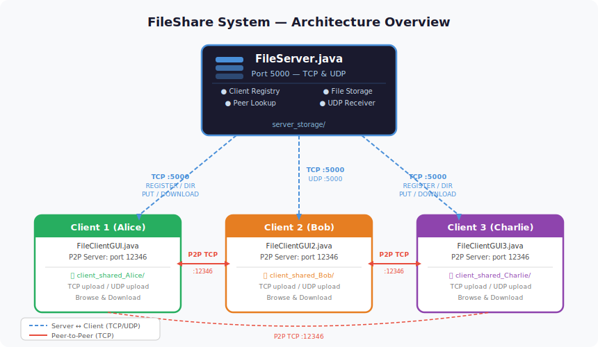
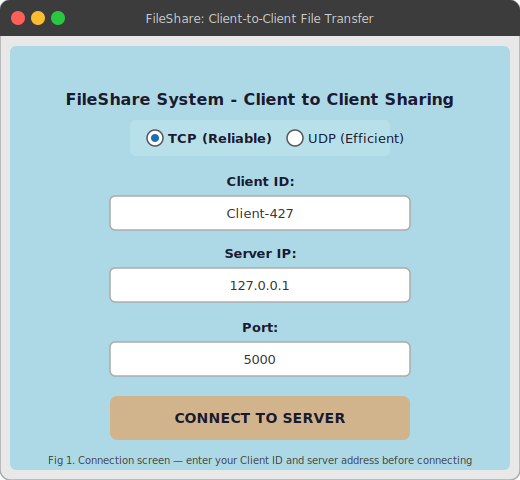
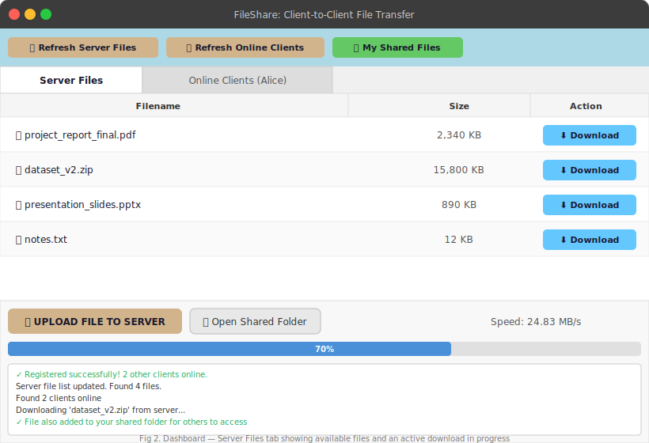
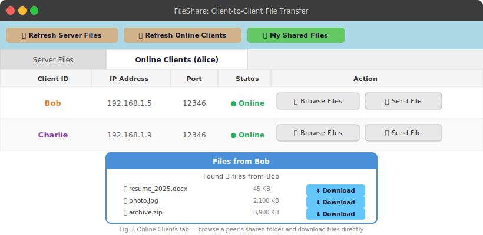
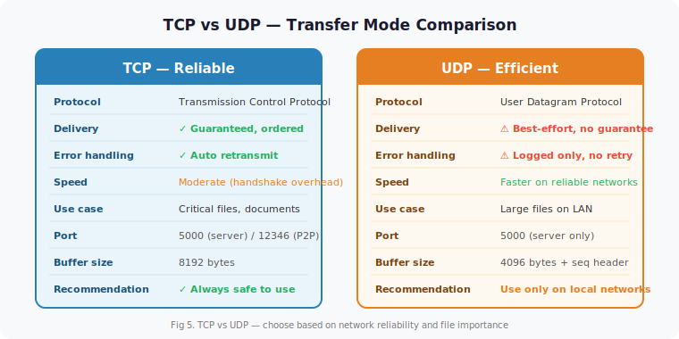

# FileShare System — Client-to-Client File Transfer

A Java-based peer-to-peer file sharing application with a central server for coordination. Supports both TCP and UDP transfers, direct client-to-client file exchange, and a Swing GUI.

---

## Architecture Overview



1. Each client **registers** with the server on startup.
2. Clients query the server for a **list of online peers**.
3. Files can be transferred via the server (PUT/DOWNLOAD) or **directly peer-to-peer** (port 12346).
4. Each client runs its own embedded file-sharing server on port `12346`.

---

## Project Structure

```
fileshare/
├── com/fileshare/server/
│   └── FileServer.java          # Central coordination server
└── com/fileshare/client/
    ├── FileClientGUI.java        # Client instance 1
    ├── FileClientGUI2.java       # Client instance 2 (replica)
    └── FileClientGUI3.java       # Client instance 3 (replica)
```

> `FileClientGUI2.java` and `FileClientGUI3.java` are replicas of `FileClientGUI.java`. Run each in a separate JVM process to simulate multiple peers on the same machine.

---

## Components

### `FileServer.java`

The central server listens on **port 5000** for both TCP and UDP traffic.

**TCP Commands handled:**

| Command | Description |
|---|---|
| `REGISTER` | Registers a client with its ID, IP, and port |
| `GET_CLIENTS` | Returns a list of all other connected clients |
| `DIR` | Lists files stored on the server |
| `PUT` | Receives a file upload from a client |
| `DOWNLOAD` | Sends a file to a client |
| `DOWNLOAD_FROM_CLIENT` | Looks up a peer's address for direct P2P transfer |

**Storage:** Files are saved to `server_storage/` in the working directory.

---

### `FileClientGUI.java` (and replicas)

A Swing-based GUI client. Each instance represents one peer in the network.

#### Connection Screen



**Key fields:**
- **Client ID** — unique name for this peer (e.g. `Alice`, `Bob`)
- **Server IP** — address of the running `FileServer`
- **Port** — default `5000`
- **Protocol** — TCP (reliable) or UDP (fast) for server uploads

#### Dashboard — Server Files Tab



Browse all files stored on the server, download any of them, and upload new files via TCP or UDP.

#### Dashboard — Online Clients Tab



See which peers are online, browse their shared folders, download files directly from them, or push a file to a peer.

**Ports used by the client:**

| Port | Purpose |
|---|---|
| `5000` | Communication with the central server |
| `12346` | Embedded P2P server (receives files from other clients) |

**Shared folder:** `client_shared_<ClientID>/` in the working directory. Files uploaded to the server or downloaded from it are automatically copied here so other peers can access them.

---

## Transfer Modes



### TCP Upload (to server)
Reliable, ordered delivery. Recommended for critical files. Uses a persistent socket stream with progress tracking and an 8192-byte buffer.

### UDP Upload (to server)


Faster for large files on reliable local networks. Each chunk is wrapped in a sequenced `DATA` packet. The server detects and logs any gaps, but **does not retransmit**. Use TCP if data integrity is essential.

### Peer-to-Peer (client to client)
Always uses TCP via a direct socket connection to the peer's embedded server on port `12346`. Two modes:

- **Browse & Download** — View a peer's shared folder and pull a specific file.
- **Send File** — Push a file directly to a peer; the recipient is prompted to accept or decline.

---

## Running the Application

### Prerequisites

- Java 11 or higher
- No external dependencies (uses standard Java libraries + Swing)

### 1. Compile

```bash
javac -d out com/fileshare/server/FileServer.java
javac -d out com/fileshare/client/FileClientGUI.java
# Repeat for FileClientGUI2.java, FileClientGUI3.java
```

### 2. Start the Server

```bash
java -cp out com.fileshare.server.FileServer
```

Expected output:
```
=========================================
File Sharing Server Started
TCP & UDP Listening on port: 5000
Storage directory: /path/to/server_storage
=========================================
✓ TCP Server listening on port 5000
✓ UDP Server listening on port 5000
```

### 3. Start Client Instances

Open separate terminals for each client:

```bash
# Terminal 1
java -cp out com.fileshare.client.FileClientGUI

# Terminal 2
java -cp out com.fileshare.client.FileClientGUI2

# Terminal 3
java -cp out com.fileshare.client.FileClientGUI3
```

Each client will show the connection screen. Enter a unique **Client ID** (e.g. `Alice`, `Bob`, `Charlie`) before clicking **CONNECT TO SERVER**.

---

## Creating Additional Client Instances

To add more clients beyond the three provided, copy `FileClientGUI.java` and change the class name:

```bash
cp com/fileshare/client/FileClientGUI.java com/fileshare/client/FileClientGUI4.java
```

Then edit the new file:
```java
// Change line:
public class FileClientGUI extends JFrame {
// To:
public class FileClientGUI4 extends JFrame {

// And update main():
SwingUtilities.invokeLater(() -> new FileClientGUI4());
```

> Each client instance must be run in its own JVM process. Running two instances of the same class in the same JVM will cause port `12346` conflicts.

---

## Known Limitations

- The UDP server does not retransmit lost packets — packet loss on unreliable networks will corrupt the file.
- All clients sharing a machine use the same P2P port (`12346`). When running multiple instances locally, ensure each replica uses a unique port (modify `dos.writeInt(12346)` in `registerWithServer()` and the `new ServerSocket(12346)` in `startFileSharingServer()`).
- Client registration is not persistent — if the server restarts, clients must reconnect.
- No authentication or encryption is implemented.
